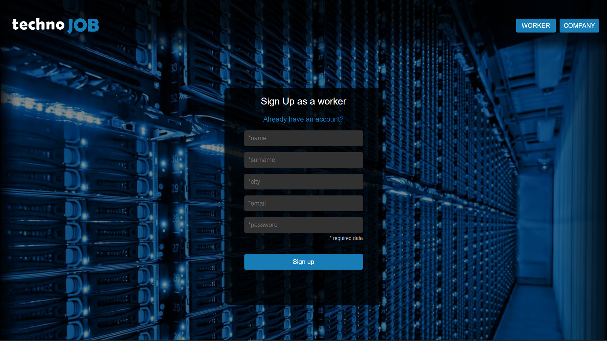

# Parte FRONTEND del proyecto TECHNOJOB.

> Frontend desarrollado en Angular version 8.3.19. que simula un portal de busqueda de empleo tecnológico.

> Trabaja conjuntamente con el backend [technojob-backend](https://github.com/RodXIII/technojob-backend/tree/dev).

## Screenshots

